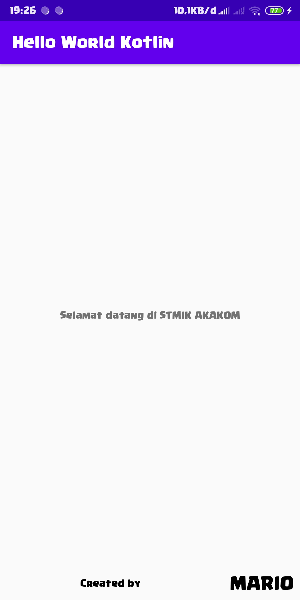

# android-helloworld-kotlin

## PRAKTIK

1. Membuat project baru<br/>
<br/>
3. Tampilan awal setelah membuat project baru<br/>
<br/>
4. Pada kelas MainActivity seperti berikut<br/>
```kotlin
class MainActivity : AppCompatActivity() {
    // apa saja
}
```
5. Berarti kelas MainActivity adalah turunan dari kelas AppCompatActivity
6. Sedangkan AppCompatActivity sendiri adalah subkelas dari kelas Activity yang mendukung semua fitur Android modern sambil memberikan kompatibilitas dengan versi Android yang lebih lama. Untuk membuat aplikasi kita tersedia untuk sejumlah besar perangkat dan pengguna mungkin, selalu gunakan AppCompatActivity.<br/>
7. Perhatikan metode ```onCreate()```. Activity tidak menggunakan konstruktor untuk menginisialisasi objek. Sebagai gantinya, serangkaian metode yang telah ditentukan (disebut "metode siklus hidup") disebut sebagai bagian dari pengaturan aktivitas. Salah satu metode siklus hidup tersebut adalah ```onCreate()```, yang selalu ditimpa di aplikasi kita sendiri.<br/>
8. Di ```onCreate()```, kita menentukan layout mana yang dikaitkan dengan aktivitas, dan Anda mengembang tata letak. Metode setContentView () melakukan kedua hal itu.<br/>
```kotlin
override fun onCreate(savedInstanceState: Bundle?) {
    super.onCreate(savedInstanceState)
    setContentView(R.layout.activity_main)
}
```
10. Metode ```setContentView()``` mereferensikan layout menggunakan ```R.layout.activity_main```, yang sebenarnya merupakan referensi integer. Kelas R dihasilkan ketika kita membangun aplikasi kita. Kelas R mencakup semua aset aplikasi, termasuk konten direktori res.<br/>
11. ```R.layout.activity_main``` merujuk ke kelas R yang dihasilkan, folder layout, dan file layout ```activity_main.xml```. (Sumber daya tidak termasuk ekstensi file) Kita akan merujuk ke banyak sumber daya aplikasi (termasuk gambar, string, dan elemen dalam file layout) menggunakan referensi serupa di kelas R.<br/>
<br/>
12. Untuk menjalankan aplikasi atau debugging, dapat dilakukan dengan dua cara.<br/>
    - [ ] Emulator \(Tidak terinstall)
    - [x] Mobile device \(Sudah siap)<br/>
      - Siapkan smartphone dan kabel data. Smartphone dengan OS Mobile Android, sedangkan kabel data adalah kabel yang dapat membaca data dari smartphone ke laptop (karena beberapa kasus terdapat kabel data yang hanya dapat digunakan untuk mengisi power atau baterai).
      - Penggunaan physical device dalam melakukan debug memerlukan beberapa pengaturan pada smartphone yaitu mengaktifkan developer option pada smartphone.<br/>
         - Pada perangkat mobile masuk ke **Pengaturan > Tentang telepon**
         - Klik beberapa kali pada bagian **Versi MIUI** dengan cepat sampai ada popup pesan bahwa **Anda sudah menjadi pengembang**
         - Kembali ke tampilan awal **Pengaturan** lalu masuk ke **Setelan tambahan > Opsi pengembang**
         - Scroll kebawah dan aktifkan **Debugging USB**<br/>
13. Setelah konfigurasi di langkah sebelumnya selesai, maka kita bisa melakukan debugging pada aplikasi kita menggunakan media emulator atau mobile device.
<br/><br/>
## LATIHAN

1. Ganti tulisan _"Hello wold"_ dengan tulisan _"Selamat datang di STMIK AKAKOM"_.<br/>
   - Buka file ```activity_main.xml```
   - Pada element ___TextView___, ganti nilai atribut dari ___android:text___ menjadi _"Selamat datang di STMIK AKAKOM"_.<br/>
```xml
<TextView
        android:layout_width="wrap_content"
        android:layout_height="wrap_content"
        android:text="Selamat datang di STMIK AKAKOM"
        app:layout_constraintTop_toTopOf="parent"
        app:layout_constraintLeft_toLeftOf="parent"
        app:layout_constraintRight_toRightOf="parent"
        app:layout_constraintTop_toTopOf="parent" />
```
2. Jalankan, maka teks yang berada di tengah akan berubah
3. Tambahkan tulisan lain dengan isi file ```activity_main.xml``` seperti berikut<br/>
```xml
<?xml version="1.0" encoding="utf-8"?>
<androidx.constraintlayout.widget.ConstraintLayout xmlns:android="http://schemas.android.com/apk/res/android"
    xmlns:app="http://schemas.android.com/apk/res-auto"
    xmlns:tools="http://schemas.android.com/tools"
    android:layout_width="match_parent"
    android:layout_height="match_parent"
    tools:context=".MainActivity">

    <TextView
        android:id="@+id/helloworld"
        android:layout_width="wrap_content"
        android:layout_height="wrap_content"
        android:text="Selamat datang di STMIK AKAKOM"
        app:layout_constraintBottom_toTopOf="@id/creator"
        app:layout_constraintLeft_toLeftOf="parent"
        app:layout_constraintRight_toRightOf="parent"
        app:layout_constraintTop_toTopOf="parent" />

    <TextView
        android:id="@+id/label_creator"
        android:layout_width="0dp"
        android:layout_height="wrap_content"
        android:text="Created by "
        android:textAlignment="center"
        android:textColor="@android:color/black"
        app:layout_constraintBottom_toBottomOf="parent"
        app:layout_constraintTop_toTopOf="@id/creator"
        app:layout_constraintStart_toStartOf="parent"
        app:layout_constraintEnd_toStartOf="@id/creator"/>

    <TextView
        android:id="@+id/creator"
        android:layout_width="wrap_content"
        android:layout_height="wrap_content"
        android:padding="8dp"
        android:text="MARIO"
        android:textStyle="bold"
        android:textSize="26sp"
        android:textColor="@android:color/black"
        app:layout_constraintBottom_toBottomOf="parent"
        app:layout_constraintEnd_toEndOf="parent"/>

</androidx.constraintlayout.widget.ConstraintLayout>
```
4. Jalankan, maka hasilnya akan seperti berikut<br/>
<br/><br/>

## TUGAS

1. Membuat aplikasi android dengan perangkat komputer dirumah dan jalankan di perangkat mobile. :heavy_check_mark:<br/>
> Sudah termasuk saat sedang praktik
2. Jelaskan tentang isi file ```activity_main.xml```<br/>
> File ini berisi tentang layout atau tampilan untuk diguanakan di aplikasi. Pada kasus ini file tersebut digunakan sebagai tampilan sebuah activity yaitu MainActivity.
> Untuk isi dari file _activity_main.xml_, memuat semua data tentang layout yang akan ditampilkan. Dengan _root element_ ___androidx.constraintlayout.widget.ConstraintLayout___ dan memiliki 3 _child element_ ___TextView___. Ketiga elemen ___TextView___ berisi data tentang teks yang akan ditampilkan, dan setiap elemen bisa diubah style-nya sesuai kebutuhan.<br/>
```xml
<TextView
    android:id="@+id/label_creator"
    android:layout_width="0dp"
    android:layout_height="wrap_content"
    android:text="Created by "
    android:textAlignment="center"
    android:textColor="@android:color/black"
    app:layout_constraintBottom_toBottomOf="parent"
    app:layout_constraintTop_toTopOf="@id/creator"
    app:layout_constraintStart_toStartOf="parent"
    app:layout_constraintEnd_toStartOf="@id/creator"/>

<TextView
    android:id="@+id/creator"
    android:layout_width="wrap_content"
    android:layout_height="wrap_content"
    android:padding="8dp"
    android:text="MARIO"
    android:textStyle="bold"
    android:textSize="26sp"
    android:textColor="@android:color/black"
    app:layout_constraintBottom_toBottomOf="parent"
    app:layout_constraintEnd_toEndOf="parent"/>
```
> Kedua elemen tersebut akan berada dibagian bawah layar (bukan dibawah layar), dengan _label_creator_ berada di kiri dan _creator_ di kanan. Dan setiap elemen memiliki style yang berbeda beda seperti ukuran yang berbeda, warna, alignment, textStyle, dal lain-lain.
